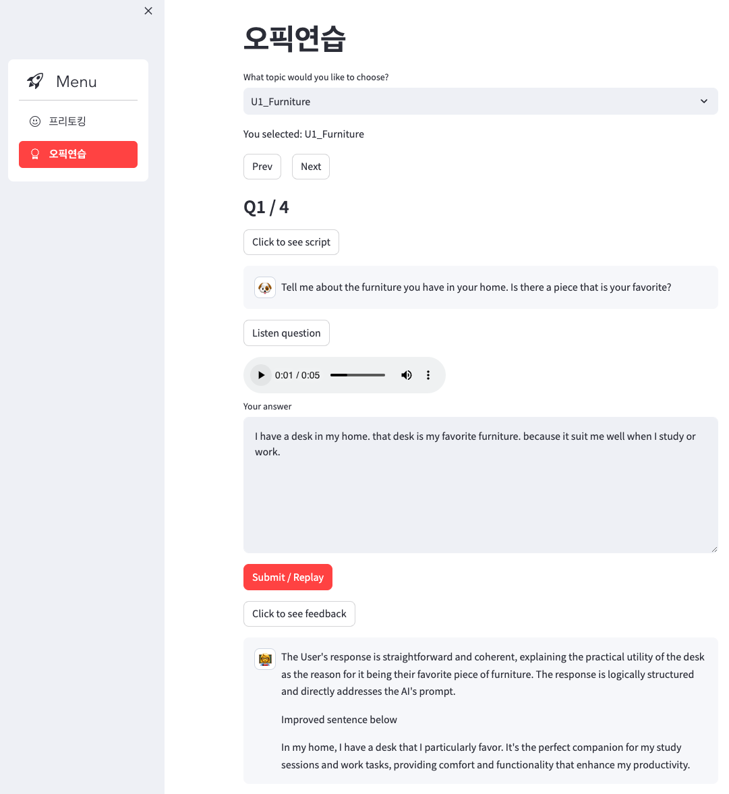

## 채팅형 영어 학습 애플리케이션

## Tech

- Backend Framework : 
- Web Application Framework : 
- External API :  

## 시연



## 환경
- python 3.11

## 실행방법
- FastAPI 서버 가동
```commandline
uvicorn backend:app --reload
```

- Streamlit 서버 가동
```commandline
streamlit run app.py
```

## 개발 과정 히스토리
<details>
    <summary>자세히</summary>

<!-- summary 아래 한칸 공백 두고 내용 삽입 -->
### 3/19
- Feedback AI 추가
- 문장 문법, 자연스러움 체크 버튼추가
- 자동재생이 안될 때가 있음 문장 2개까지는 잘되다가 3번째 버튼 누르면 자동재생이 안됐는데, (with st.chat_message("assistant"):로 묶었더니 해결됨)

### 3/20
- Replay 버튼 추가
- Feedback AI 마이크 & 채팅창 추가 (사용자가 직접 타이핑할 수 있도록)

### 3/25
- LLM이 준 영어 쉽게 설명해주는 버튼(영어로 말하도록 tts사용)

### 3/26
- tts api 백엔드에서 진행하도록 수정

### 4/11
- 히스토리 가리기 업데이트

### 4/12
- 오픽연습 탭, 페이지네이션, 재생기, textarea 및 버튼 추가

### 4/13
- 오픽연습 탭, 토픽선택해서 데이터  화면으로 가져오기 구현완료
- 스크립트 가리기 버튼 추가
- tts 구현 및 피드백 AI 구현완료
</details>

## 미해결 이슈
<details>
    <summary>자세히</summary>

<!-- summary 아래 한칸 공백 두고 내용 삽입 -->

- 페이지에 따라 음성파일 이름 저장해서, 이미 있으면 TTS API 또 요청하지 않도록하기

- 작성한 글이 자동 저장이 잘 안되는 것 같다. 한번은 저장되고 한번은 저장이 안되는 이슈가 있음
</details>

## 추후 추가하고 싶은 기능
<details>
    <summary>자세히</summary>

<!-- summary 아래 한칸 공백 두고 내용 삽입 -->
- 대화 히스토리를 보고 전체적인 평가 및 피드백해주는 기능
</details>